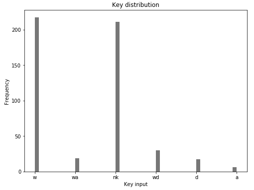
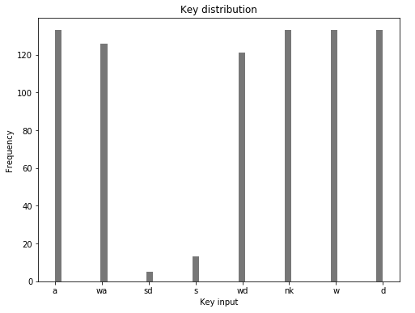

# Self-driving Car in GTA-V#
## Demo ##
### Driving in the City & Detecting Objects ###

## About ##
The goal of this project is to build a self-driving car with deep learning and computer vision, which can navigate in different environments. The project is inspired by the work done by Sentdex. After experimenting with different convolutional neural networks, Google's InceptionV3 seems to offer the best prediction results. SSD MobileNet is also integrated along the inference pipeline to add collision avoidance capacity to the whole system by detection other vehicles in real-time.
Detailed Explaination: https://marsolmos.com/files/projects/gtautodrive_project.html
## Setup and Requirements ##
1. Grand Theft Auto-5 (no mods are required)
2. Python (3.6.12)
3. Tensorflow GPU (2.3.1)
4. Keras
5. OpenCV
6. Numpy

## Dataset ##
### My Dataset ###
150,000 images with respective keyboard keys pressed at that moment are collected by driving the car around the map. However, only 11,235 images are left after balancing and expanding the data.
#### Unbalanced ####

#### Balanced ####

### Custom Dataset ###
Use 1_collect_data.py to generate your custom dataset. Ensure the GTA-5 window size same as in the collect_data.py and that it's located in the top left corner of your screen.
Save the collected data into a custom path in your machine and use it to train your model.
## Training Tensorlfow GPU (2.3) ##
[Training code can be found here](https://github.com/marsolmos/gtautodrive/blob/master/3_train_model.py)
1. Set the path to your training data
2. Correctly set up envirnonment (ensure GPU is enable)
3. Run the code

## Usage ##
1. Download or clone this repo
2. Install all dependencies in requirements.txt
3. Set up paths to your local folders before collecting data
4. Run 1_collect_data.py to get in-game data
5. Run 2_balance_data.py to balance collected data in step 1
6. Run 3_train_model.py to train your model
7. Open GTA-V and run 4_test_model.py to make your model drive

## Future Improvements ##
1. Collect more and better data (hood camera, better line detection, etc.)
2. Increase object detection speed and include it on training data
3. Split pipelines into urban and highway driving models
4. Include analogic key input (joystick)
5. Include custom sensors (GPS, LIDARs, etc.)

## Acknowledgement ##
Sentdex: https://github.com/Sentdex/pygta5
